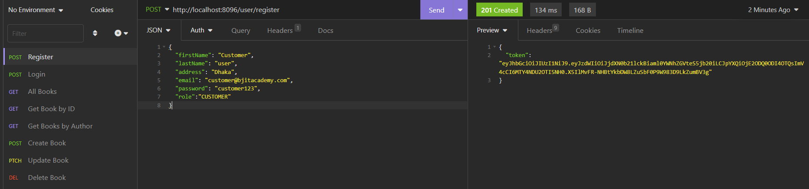
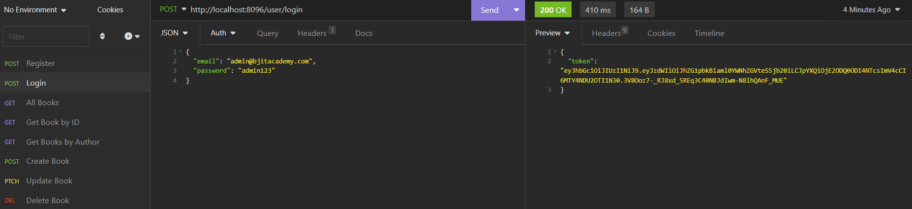
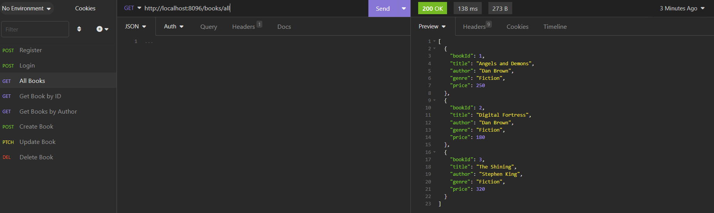
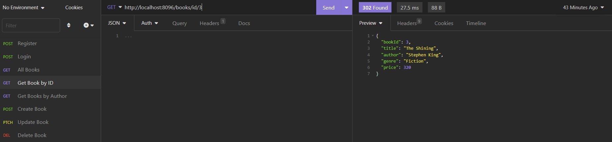
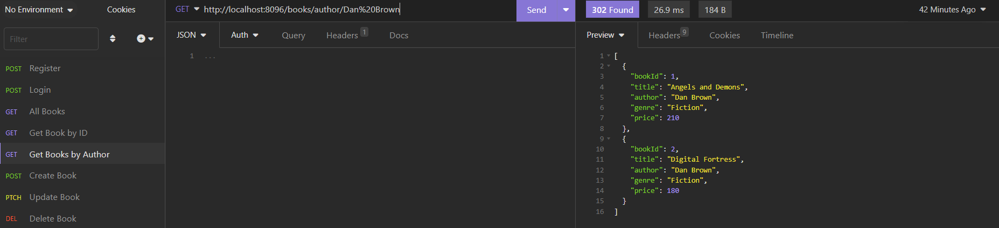
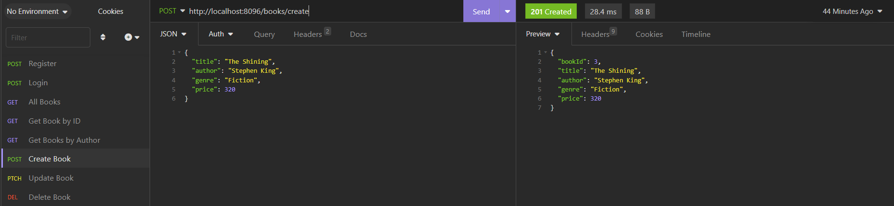
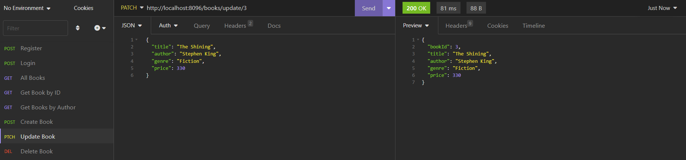
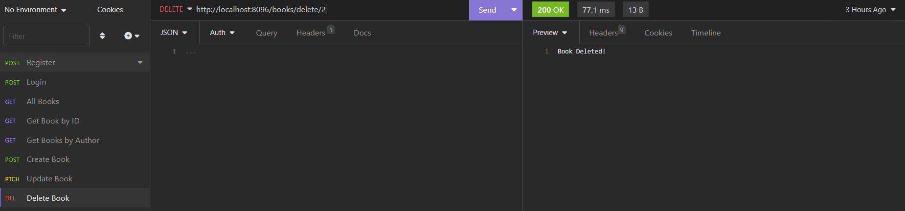

# Online Book Library Application

This project demonstrates the implementation of security using Spring Boot and JSON Web Tokens (JWT).

## Features

* User registration and login with JWT authentication
* Password encryption using BCrypt
* Role-based (CUSTOMER, ADMIN) authorization with Spring Security
* Customized access denied handling

## Technologies

* Spring Boot
* Spring Security
* JPA
* JSON Web Tokens (JWT)
* BCrypt
* Gradle
* MySQL

## Getting Started

To get started with this project, you will need to have the following installed on your local machine:

* JDK 17+
* Gradle
* MySQL driver

To build and run the project, follow these steps:

* Login to mySQL driver with user "root" and password "root"
* Add database "project_db" to mySQL
* Run the project

The application will run at http://localhost:8096

## Functions (Links and Mappings)

**Permitted by all:**

Post mapping (firstName, lastName, email and password) for registration: http://localhost:8096/user/register

Post mapping (email and password) for login: http://localhost:8096/user/login

 

**Permitted by CUSTOMER and ADMIN roles:**

Get mapping to view all books: http://localhost:8096/books/all

Get mapping to view details of a book: http://localhost:8096/books/id/{id}

Get mapping to view all books by an author: http://localhost:8096/books/author/{author}

 

**Permitted by ADMIN roles:**

Post mapping (title, author, genre and price)  to create a book: http://localhost:8096/books/create

Patch mapping to update a book: http://localhost:8096/books/update/{id}

Delete mapping to delete a book: http://localhost:8096/books/delete/{id}

